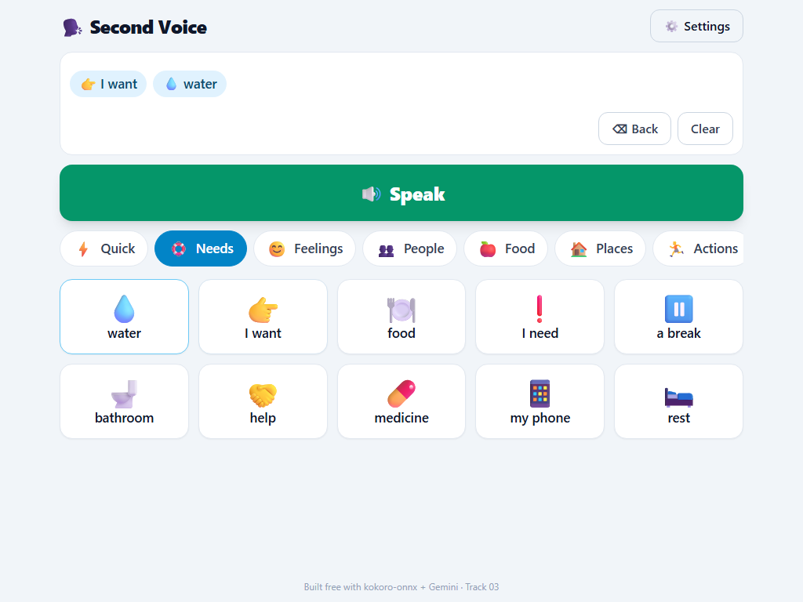
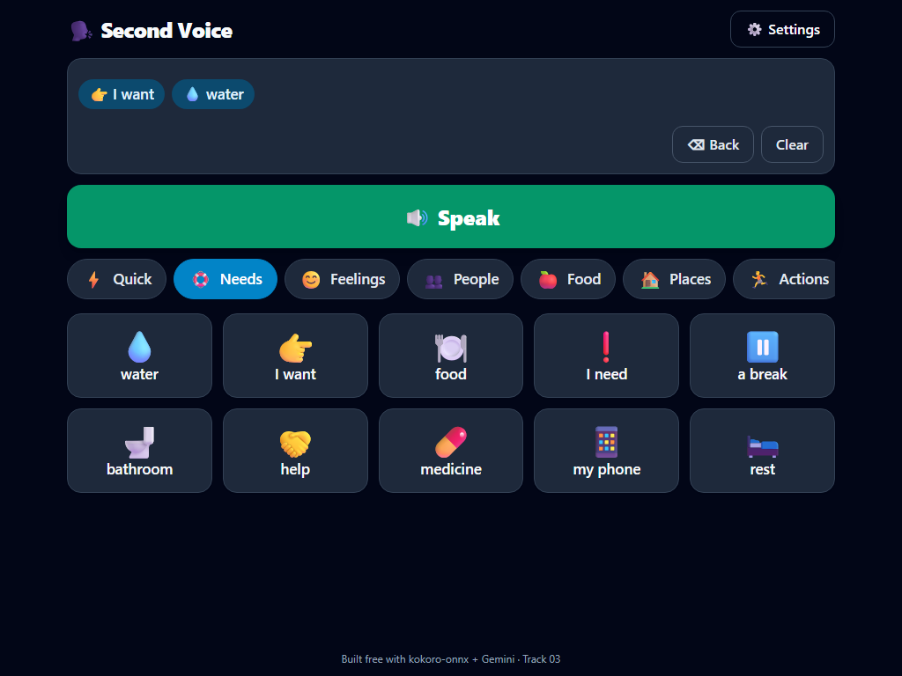

# 🗣️ Second Voice

**A free, accessible AI-powered communication app for non-verbal and autistic users.**

Tap picture tiles to build a message. Gemini AI turns those tiles into a natural sentence. An on-device neural voice speaks it aloud — all for free, no GPU required, installable on any tablet.


---

| Light Mode | Dark / High-Contrast Mode |
|:---:|:---:|
|  |  |

---

## What is Second Voice?

Second Voice is an AAC (Augmentative and Alternative Communication) web app. AAC tools help people who cannot speak — whether due to autism, ALS, cerebral palsy, stroke, or other conditions — communicate by selecting symbols, words, or phrases that are then spoken aloud.

Commercial AAC devices cost $3,000–$15,000. Most apps require paid subscriptions. Second Voice does it for **$0** using AI.

### How it works

1. **Tap tiles** — 70 picture+text tiles across 7 categories (Quick, Needs, Feelings, People, Food, Places, Actions)
2. **AI composes** — Gemini 2.5 Flash turns your tapped keywords into a natural first-person sentence
3. **Speaks aloud** — kokoro-onnx synthesizes natural speech on CPU in under 1 second
4. **Learns** — tiles you use most automatically float to the top

Quick replies like "Yes", "No", and "I need help" speak with a single tap.

---

## Tech Stack

| Layer | Technology |
|-------|-----------|
| Frontend | React, TypeScript, Vite, Tailwind CSS, Zustand, PWA |
| Backend | Python, FastAPI, SQLite |
| AI Composition | Google Gemini 2.5 Flash (free tier) |
| Text-to-Speech | kokoro-onnx (82M parameter neural TTS, CPU) |
| Testing | Playwright (E2E), custom smoke tests |
| Deployment | Docker, Nginx, DigitalOcean |

---

## Accessibility Features

- **Large tap targets** (min 96px) with symbol + text on every tile
- **High-contrast dark mode** toggle
- **Adjustable text size** (80%–200%)
- **Scanning mode** — auto-highlights tiles in sequence; single-switch/Space selects (for motor-impaired users)
- **ARIA labels** and visible focus indicators throughout
- **PWA** — installs full-screen on a tablet like a dedicated device

---

## Setup

### Prerequisites

- Python 3.12+
- Node.js 22+
- A free [Google Gemini API key](https://aistudio.google.com/apikey)

### 1. Clone and set up environment variables

```bash
git clone <your-repo-url>
cd second-voice
```

Create a `.env` file in the project root:

```env
GEMINI_API_KEY=your-gemini-api-key-here
HUGGINGFACE_TOKEN=your-hf-token-here
```

> **Without `GEMINI_API_KEY`** the app still works — it joins tiles into a sentence without AI composition.  
> **`HUGGINGFACE_TOKEN`** is reserved for future voice-cloning features; not required for the MVP.

### 2. Backend setup

```bash
cd backend
python -m venv .venv

# Windows:
.\.venv\Scripts\activate
# macOS/Linux:
# source .venv/bin/activate

pip install -r requirements.txt
```

### 3. Download the TTS model

The Kokoro voice model (~350 MB total) needs to be downloaded once:

```bash
python scripts/download_models.py
```

This downloads two files into `backend/models/`:
- `kokoro-v1.0.onnx` (325 MB) — the neural TTS model
- `voices-v1.0.bin` (28 MB) — voice pack with 10 natural voices

### 4. Start the backend

```bash
uvicorn app.main:app --host 127.0.0.1 --port 8000
```

You should see:
```
INFO: Loading Kokoro model...
INFO: Kokoro model loaded
INFO: Second Voice backend ready
INFO: Uvicorn running on http://127.0.0.1:8000
```

### 5. Frontend setup

Open a new terminal:

```bash
cd frontend
npm install
npm run dev
```

### 6. Open the app

Go to **http://localhost:5173** — the app is ready to use.


## Project Structure

```
second-voice/
├── backend/
│   ├── app/
│   │   ├── main.py          # FastAPI app + startup
│   │   ├── config.py        # Environment config
│   │   ├── db.py            # SQLite connection + schema
│   │   ├── tts.py           # kokoro-onnx TTS wrapper
│   │   ├── gemini.py        # Gemini composition + fallback
│   │   ├── seed.py          # Default tile data
│   │   ├── schemas.py       # Pydantic models
│   │   └── routers/         # board, compose, speak endpoints
│   ├── models/              # .onnx + .bin (gitignored, download via script)
│   ├── scripts/
│   │   ├── download_models.py
│   │   └── smoke_test.py
│   ├── requirements.txt
│   └── Dockerfile
├── frontend/
│   ├── src/
│   │   ├── App.tsx          # Main app with board + interactions
│   │   ├── api.ts           # Typed API client
│   │   ├── store.ts         # Zustand state (sentence, settings)
│   │   └── components/      # Tile, CategoryTabs, SentenceBar, SettingsPanel
│   ├── public/icon.svg
│   ├── e2e/                 # Playwright E2E tests
│   ├── Dockerfile
│   └── nginx.conf
├── docs/
│   ├── board-light.png
│   └── board-dark.png
├── docker-compose.yml
├── .env.example
└── README.md
```

---

## License

MIT
